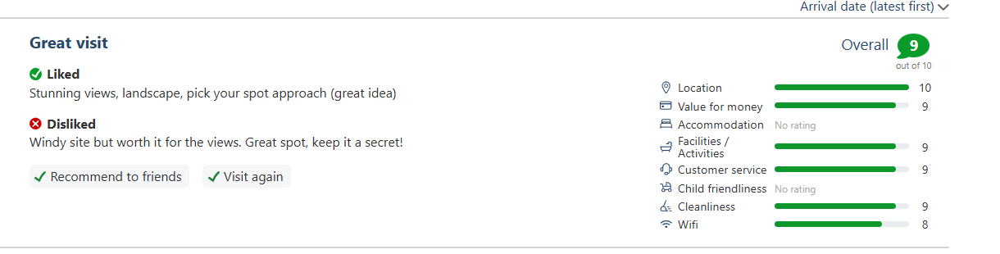

## Constructor functions and keeping code clean!

**The Problem**

For the week 2 and week 3 assignments, both involved a similar loop in that they were pulling data from an object and rendering it to the screen. Within those loops I was also creating the elements to render to the DOM, as well as giving them classes and appending them to the containers they needed to be in etc. This weeks assignment presented the same challenge -> take the API data pulled from our database and render it on the screen.

I initially started doing this exactly like I had done before. I created a function to initialise the reviews to the screen, yet this time because each 'review' had many different parts, the function became more about 'creating' the structure of the review instead of just initialising them, and the function got very large.

**Solution**
I decided to take a different approach for this weeks for loop. I wanted to put into practice a type of function that I had learned about called Constructor Functions. Constructors are essentially like a template for an object that we can instantiate and change values based on input parameters.

I separated all of my code responsible for creating the individual elements for a review and put them into one constructor function, then calling that function with the new keyword to create a new instance of that object.

The constructor function alone was around 170 lines of code, so I decided to put the function in it's own .js file and export it, then import it into my main app.js file to call it. This method felt MUCH cleaner and readable when looking through my code as it meant that I didn't have to scroll past 170 lines of code setting up the DOM elements.

```javascript
async function initReviews() {
  const reviews = await getReviews();
  console.log(reviews);

  for (const review of reviews) {
    new CreateReview(
      review.name,
      review.message,
      review.locationscore,
      review.valuescore,
      review.facilitiesscore,
      review.cleanlinessscore,
      review.servicescore
    );
  }
}
initReviews();
```

## "Score Bars" for the user reviews

**The Challenge**

I got inspiration for 'score bars' next to a review by looking at other websites for rating campsites. One particularly popular website called 'pitchup' has these and I wanted to replicate it.


**Solution**

When inspecting the page I could see that each bar had it's width set as a percentage which made replicating this quite simple. Since the rating system is out of 10, a score of 10 would be 100%, and therefore a score of 7 would be 70%. Taking the review score and appending "0%" to the end of the value would give me the width size that it would need to be.
setting the width as a percentage of the bar

## Design Principles - Ease of use

When thinking about who would use this website, particularly this page, it's because a user may make a review of their own, but also to serve as a testimony page of sorts for potential customers. In my own experience when looking for campsites, the things that I value to determine if it's right for me are different to other peoples values. For example, I don't particularly care about the campground facilities, as long as it's in a great location, whereas others really depend on these facilities for various reasons. Reviews are very opinionated, and some users looking at campsites often don't care about the ramblings, they just want quick numbers to compare.

For my form i've decided to collect scores of various aspects of the grounds so that the customers can pick out the data that they want without having to scour the review text if they don't want to. Often times when people are looking for campsites, they have many tabs open and if they can't get a quick 'vibe check' they might just close out.

# Resources

[W3Schools Constructor Functions](https://www.w3schools.com/js/js_object_constructors.asp)

[DELETE method request](https://stackoverflow.com/questions/40284338/javascript-fetch-delete-and-put-requests)

[DELETE method request 2](https://blog.stackademic.com/demystifying-fetch-a-guide-to-get-post-patch-and-delete-da8514f041e4)

[score bar inspiration](https://www.pitchup.com/campsites/England/North_East/North_Yorkshire/Skipton/draughton-heights-campsite/)

[HTML dropdown select option](https://www.w3schools.com/tags/tag_select.asp)

[HTML dropdown validation](https://stackoverflow.com/a/44638785)
