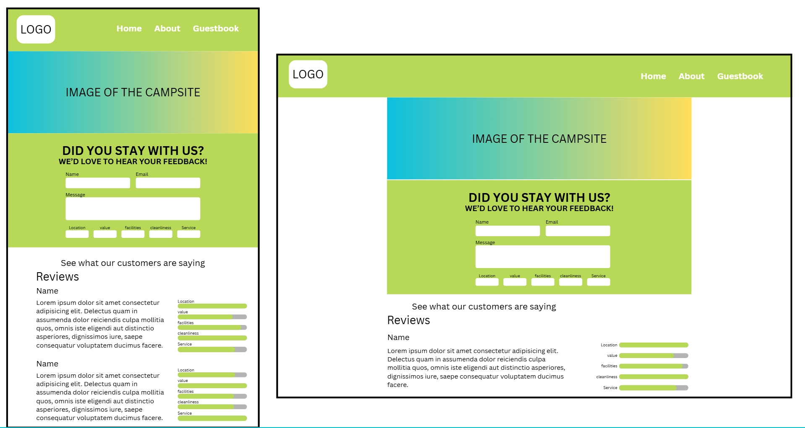

## What does “done” look like?

The app would be considered "done" for our purposes when our user stories have been met.

**The User Stories:**

🐿️ As a user, I’d like to fill out a working form so that I can submit my information effectively and without issues.

- 🎯 Ensure your HTML form is working and submitting data into the database as expected.
  - Needs a HTML Form
  - Needs a Database
  - Needs a Server to handle the request.

🐿️ As a user, I want the application to work as expected on my mobile device so that I can access and use it conveniently on the go.

- 🎯 Confirm that your project is functional on multiple screen sizes using either Responsive Design or media queries.
  - mobile-first design
  - media queries to set breakpoints for larger sizes
  - responsive design using relative units

🐿️ As a developer, I want to create a working API GET route so that I can retrieve data from the server and display it to the users.

- 🎯 Create a working GET API route in your server.
  - create a get route in my server.js file
  - configure a way to query our database to get information from the database
  - render the information to the DOM by having our client fetch the requested API

🐿️ As a developer, I want to create a working API POST route so that users can send data to the server and store it.

- 🎯 Create a working POST API route in your client.

🐿️ As a developer, I want to create and seed a database with dummy data so that I have realistic test data for development purposes.
Requirements

- 🎯 Seed your database with realistic-looking ‘dummy’ data through the Supabase query editor or a seed file in your server. Ensure that this is saved and submitted (in a screenshot or seed file form) so it can be marked and tested efficiently.
  - Add some dummy data into the database table using the SQL editor on SupaBase
  - Screenshot the SQL commands used to add the dummy data and add it to the repo

What type of user will use your app?
What are the user’s needs?

**Problem Domain:**
Offers collated user-made reviews of a campsite to help customers make informed decisions on whether the campsite is right for them.

## Wireframe

